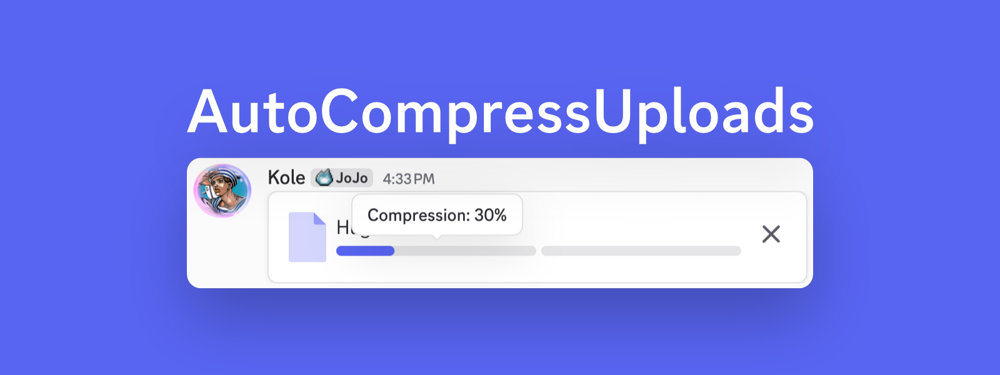

# Auto Compress Uploads

Automatically compresses oversized media on-device before Discord uploads it.

Attach a supported file and send it normally. The plugin detects Discord's limit, compresses the file below it, and then uploads it.

Files never leave your device for compression, and originals are never modified.



## Install

Custom plugins require a [source-built Vencord](https://docs.vencord.dev/installing/custom-plugins/). Clone this repository directly into Vencord's userplugins folder, then rebuild:

```sh
cd Vencord/src/userplugins
git clone https://github.com/kolehoenicke/AutoCompressUploads.git
cd ../..
pnpm build
```

Restart Discord, open `Settings → Vencord → Plugins`, and enable **AutoCompressUploads**.

To update later:

```sh
cd Vencord/src/userplugins/AutoCompressUploads
git pull
cd ../..
pnpm build
```

## Supported files

- Still images: JPEG, PNG, WebP, and AVIF. Output is WebP.
- Animated images: GIF and APNG. Output is an animated, looping GIF.
- Audio: MP3, WAV, M4A, AAC, FLAC, Ogg, and Opus. Output is AAC/M4A or Opus/Ogg.
- Video: MP4, M4V, MOV, MKV, WebM, and MPEG transport streams. Output is H.264/AAC MP4 or VP9/Opus WebM.

Documents, archives, executables, and other arbitrary files are left to Discord unchanged.

## Behavior

- Automatically targets 4% below Discord's detected upload limit.
- Prefers open WebM/Ogg codecs on Linux and falls back between codec families on every platform.
- Chooses quality, bitrate, resolution, frame rate, and audio channels automatically.
- Compresses multiple attachments sequentially to reduce memory, heat, and encoder contention.
- Preserves the original base filename. The extension changes only when the output format changes.
- Stays silent after successful sends and reports failures that need attention.
- Provides privacy-safe diagnostics containing file type, sizes, runtime capabilities, and errors—never file contents or the full filename.

## Media engine and privacy

The plugin includes the browser bundle of [Mediabunny](https://mediabunny.dev/) 1.55.1 under its MPL-2.0 license for browser-native media conversion. It uses Discord's built-in Chromium codecs and does not require FFmpeg, another package installation, or an external service.

Video output is written progressively to browser-managed temporary disk storage instead of being retained as one large memory buffer. Temporary files are removed after completed uploads, and abandoned files are cleaned the next time the plugin starts. Systems without disk-backed browser storage fall back to memory only for targets up to 96 MB.

## Limitations

- Codec availability is determined by Discord's bundled Chromium and the operating system. The plugin tries AAC/H.264 and open Opus/VP9/VP8 alternatives before reporting an unsupported codec.
- Compression must finish before the network upload can begin.
- Very long videos may be refused when fitting them would require unusably low quality.
- Image conversion uses browser canvas APIs and can still require substantial memory for extremely high-resolution images.
- GIF conversion preserves animation and looping, but extreme reductions may lower its dimensions, color count, and frame rate.
- This is an unofficial custom plugin and is not supported by the Vencord maintainers.

Long videos automatically step down through audio bitrate, mono audio, frame rate, and resolution (as low as 240p only when necessary) before the plugin gives up. If compression still fails, the notification distinguishes unsupported codecs, videos that cannot fit above the emergency quality floor, unavailable temporary storage, and Discord uploader changes. Copy last diagnostics records sizes, file type, runtime capability, and the error without including file contents or the full filename.

## License

Created by [`kolehoenicke`](https://github.com/kolehoenicke) and released under GPL-3.0-or-later. The bundled Mediabunny files remain under MPL-2.0; see `vendor/MEDIABUNNY-LICENSE.txt`.
